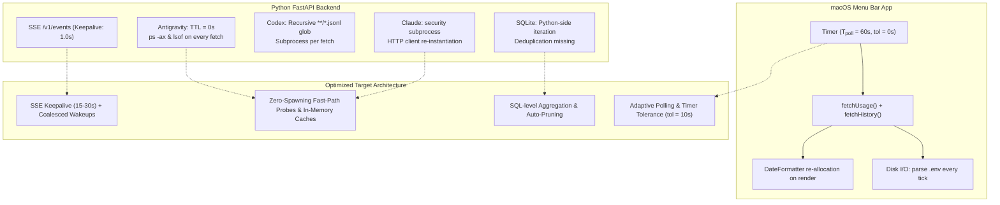

# Efficiency and Energy Consumption Optimization Design

## Goal

Optimize the **Time-to-Sleep** system across all execution layers (Python backend, macOS Menu Bar application, SQLite history engine, CLI statuslines, and Web UI) to significantly reduce CPU usage, energy/battery drain, memory churn, and disk I/O without degrading real-time accuracy or responsiveness.

---

## Architectural Profile



---

## Identified Inefficiencies & Detailed Technical Design

### 1. Antigravity Provider: Eliminate Continuous Process Scanning & Add Server Cache
* **Root Cause:**
  * `DEFAULT_TTLS["antigravity"]` is set to `timedelta(0)`.
  * `_find_server()` in `AntigravityProvider` spawns a `ps -ax -o pid=,command=` subprocess to parse every running system process, followed by an `lsof -nP -a -p <pid> -iTCP -sTCP:LISTEN` subprocess on matching PIDs on every usage fetch.
* **Design:**
  * Update baseline TTL in `services.py` from `timedelta(0)` to `timedelta(seconds=20)`.
  * In `AntigravityProvider`, maintain `_cached_server: _LocalServer | None`. Before executing `ps` and `lsof`, perform a fast HTTP POST probe (`_post_probe`) against the cached port.
  * If the probe succeeds (status 200), return the cached server immediately, bypassing `ps` and `lsof` completely ($O(1)$ fast path).
  * Only fall back to full `ps` + `lsof` process discovery if the cached server is missing or fails to respond.

### 2. FastAPI SSE Keepalive & HTTP Client Connection Pools
* **Root Cause:**
  * In `api.py` `events_stream`, the generator loops with `await asyncio.wait_for(queue.get(), timeout=1.0)` and yields `: keepalive\n\n` on timeout. This wakes up the event loop every 1.0 second (3,600 wakeups/hr), preventing CPU cores from entering deep C-states.
  * `httpx.AsyncClient` is repeatedly created and closed inside `ClaudeProvider`, `AntigravityProvider`, and `cli.py`, discarding connection pools and incurring TLS handshake overhead.
* **Design:**
  * Increase SSE keepalive timeout from `1.0s` to `20.0s`.
  * Maintain shared/reusable async HTTP clients or persistent connection pool wrappers for external provider queries to leverage socket keep-alive and connection reuse.

### 3. SQLite History Engine: Deduplication, SQL Aggregation & Auto-Pruning
* **Root Cause:**
  * `HistoryStore.record_snapshots` unconditionally inserts new rows on every `/v1/usage` query, generating redundant records when quota values have not changed.
  * `get_hourly_heatmap` queries all rows for 7 days into Python memory, creates Pydantic `HistoryPoint` instances, and iterates in Python to compute averages.
  * `HistoryStore.prune()` is never invoked automatically.
* **Design:**
  * **Deduplication:** Cache the last recorded percentage per `(account_id, window_id)`. Skip insertion if the percentage has not changed within a 5-minute window.
  * **SQL-Level Aggregation:** Replace Python-side heatmap calculation with a direct SQLite query:
    ```sql
    SELECT CAST(strftime('%H', observed_at) AS INTEGER) AS hr,
           ROUND(AVG(used_percent), 1) AS avg_pct,
           COUNT(*) AS sample_cnt
    FROM usage_history
    WHERE observed_at >= ?
    GROUP BY hr
    ```
  * **Auto-Pruning:** Call `prune(max_days=30)` asynchronously on store initialization and daily maintenance.

### 4. Claude & Codex Providers: Disk & Subprocess Optimization
* **Root Cause:**
  * `ClaudeCredentialSource._read_keychain()` executes `security find-generic-password` via `subprocess.run` on every credential request when `CLAUDE_CODE_OAUTH_TOKEN` is not set.
  * `CodexProvider._read_rollout_fallback()` performs unbounded recursive globbing `home.glob("sessions/**/*.jsonl")` and `home.glob("archived_sessions/**/*.jsonl")`, scanning thousands of old session files on disk.
* **Design:**
  * In `ClaudeCredentialSource`, cache the keychain token in memory after first retrieval; evict only upon receiving an HTTP 401 Unauthorized response.
  * In `CodexProvider._read_rollout_fallback()`, limit search depth or inspect only the top 10 most recently modified session files/directories, avoiding full directory tree traversal.

### 5. macOS Menu Bar App (`macOS/Sources/`)
* **Root Cause:**
  * `Monitor.swift`: `Timer.scheduledTimer(withTimeInterval: 60, repeats: true)` runs with 0 tolerance, executing two consecutive HTTP requests (`/v1/usage` and `/v1/history?hours=24`) every 60s even when the popover is closed.
  * `Monitor.swift`: `getPort()` reads and parses `projects/time-to-sleep/.env` from disk on every fetch tick (2x per minute).
  * `Views.swift`: `parseDate`, `formatResetsAt`, and `resetCountdown` instantiate new `DateFormatter` and `ISO8601DateFormatter` objects on every SwiftUI render cycle.
  * `BackendRunner.swift`: Spawns an interactive login shell (`zsh -il -c ...`) sourcing all startup scripts (`.zshrc`, plugins, etc.).
* **Design:**
  * In `Monitor.swift`: Add timer tolerance (`timer.tolerance = 10.0`) to allow macOS power management to coalesce wakeups. Implement adaptive backoff (e.g. 180s when popover is closed; immediate fetch on popover open).
  * In `Monitor.swift`: Cache the resolved port in memory with lazy disk fallback.
  * In `Views.swift`: Define shared `static let` formatters in a dedicated struct/enum.
  * In `BackendRunner.swift`: Execute `uv run time-to-sleep` using clean environment execution (`zsh -c`) without interactive login shell flags (`-il`).

### 6. CLI & Web UI Micro-Optimizations
* **Root Cause:**
  * `cli.py`: Running `time-to-sleep prompt` imports full `fastapi`, `uvicorn`, and `curses`, adding ~150-200ms Python startup overhead.
  * `app.js`: Timers and DOM updates continue at full rate even when the browser tab is in the background.
* **Design:**
  * Lazy-load server, TUI, and discovery dependencies in `cli.py` so `prompt` and `status` execute in <20ms.
  * Add `document.visibilityState` listener in `app.js` to throttle updates when the tab is hidden.

---

## Verification Plan

1. **Unit & Regression Testing:**
   * Run full test suite with `uv run pytest` to ensure 100% test pass rate and verify code coverage.
2. **Linter & Type Checking:**
   * Verify with `uv run ruff check .`, `uv run ruff format --check .`, and `uv run ty check`.
3. **Swift App Compilation:**
   * Compile and test macOS build via `macOS/build.sh`.
4. **Performance & Energy Verification:**
   * Measure process count, CPU time, and prompt execution latency before and after changes.
