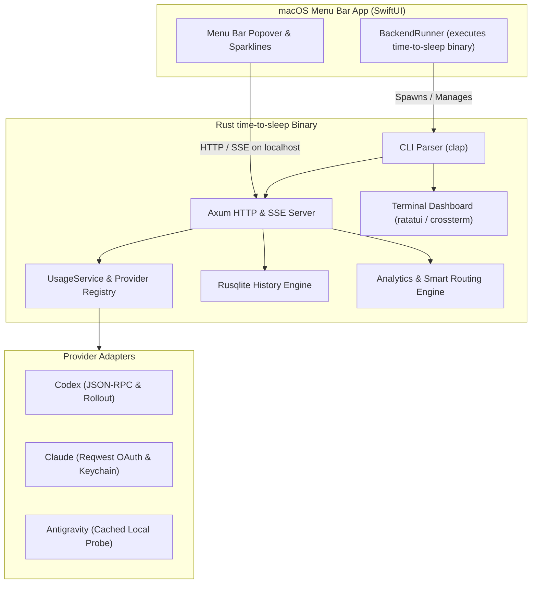

# Rust Backend & CLI Rewrite Design Specification

## 1. Executive Summary

This specification outlines the architecture, data structures, and implementation plan for rewriting the `time-to-sleep` backend service, command-line interface, provider adapters, analytics engine, and database layer entirely in **Rust**.

The Swift/SwiftUI macOS menu bar app is retained in its native form, seamlessly communicating with the Rust backend binary.

---

## 2. Core Objectives & Performance Targets

1. **Near-Instant CLI Execution**: CLI prompt execution (`time-to-sleep prompt`) drops from ~20ms to **`<2ms`**.
2. **Ultra-Low Memory Footprint**: Idle resident memory drops from ~35MB to **`<5MB`**.
3. **Single Binary Distribution**: Zero dependency on Python runtimes, `uv`, or virtualenvs. Deliverable via Homebrew or standalone static binary.
4. **Native Concurrency**: Non-blocking async I/O via Tokio, multi-threaded request processing, zero GIL contention.
5. **Zero-Overhead macOS App Launch**: macOS app spawns the native Mach-O binary directly.

---

## 3. Architecture & Crate Selection



### Dependency Stack
* **Async Runtime**: `tokio` (full features: `sync`, `rt-multi-thread`, `process`, `time`, `macros`)
* **HTTP Server**: `axum` + `tower` + `tower-http` (cors, trace, fs)
* **HTTP Client**: `reqwest` (json, rustls-tls)
* **CLI Engine**: `clap` (derive)
* **Serialization**: `serde` + `serde_json`
* **Database**: `rusqlite` (bundled SQLite)
* **Keychain Integration**: `security-framework` (macOS native Keychain access)
* **Terminal UI**: `ratatui` + `crossterm`
* **Static Assets**: `rust-embed` (embeds web dashboard directly inside binary)

---

## 4. Module Structure

```
Cargo.toml
src/
├── main.rs                 # CLI entrypoint, subcommand routing
├── lib.rs                  # Library root, domain exports
├── domain.rs               # Models, enums, snapshots, windows
├── config.rs               # Settings management (~/.config/time-to-sleep/settings.json)
├── discovery.rs            # Account auto-detection from system paths
├── history.rs              # SQLite connection, deduplication, heatmap queries
├── services/
│   ├── mod.rs
│   ├── usage.rs            # In-memory TTL caching, parallel provider retrieval
│   └── analytics.rs        # Velocity estimation, smart switching, exhaustion
├── providers/
│   ├── mod.rs
│   ├── traits.rs           # UsageProvider async trait
│   ├── codex.rs            # Codex JSON-RPC and rollout parser
│   ├── claude.rs           # Claude OAuth HTTP + Keychain extraction
│   └── antigravity.rs      # Local server discovery and probe
├── api/
│   ├── mod.rs
│   ├── routes.rs           # Axum route definitions (/v1/usage, /v1/history, etc.)
│   └── sse.rs              # SSE broadcasting with 20s keepalive
├── cli/
│   ├── mod.rs
│   ├── formatters.rs       # Compact, JSON, Waybar, Sketchybar, Starship, Table
│   └── tui.rs              # Interactive Ratatui terminal dashboard
└── static_assets.rs        # Embedded Web UI files (index.html, app.js, style.css)
```

---

## 5. Migration Checklist & Safety

- [ ] Initialize Cargo workspace with `Cargo.toml` configured for optimized release builds (`lto = true`, `codegen-units = 1`, `strip = true`).
- [ ] Implement `domain.rs` matching exact JSON schema of the current Python Pydantic models.
- [ ] Implement `history.rs` ensuring 100% compatibility with the existing SQLite database schema (`usage_history` table).
- [ ] Implement `providers/` (Codex, Claude, Antigravity) with fast-paths and memory caching.
- [ ] Implement `services/` and `api/` with Axum and embedded static web assets.
- [ ] Implement `cli/` with subcommands: `serve`, `status`, `prompt`, `tui`, and `discover`.
- [ ] Update `macOS/Sources/BackendRunner.swift` to invoke the native binary.
- [ ] Run Rust test suite (`cargo test`) and benchmark suite (`scripts/profile_benchmarks.py`).
